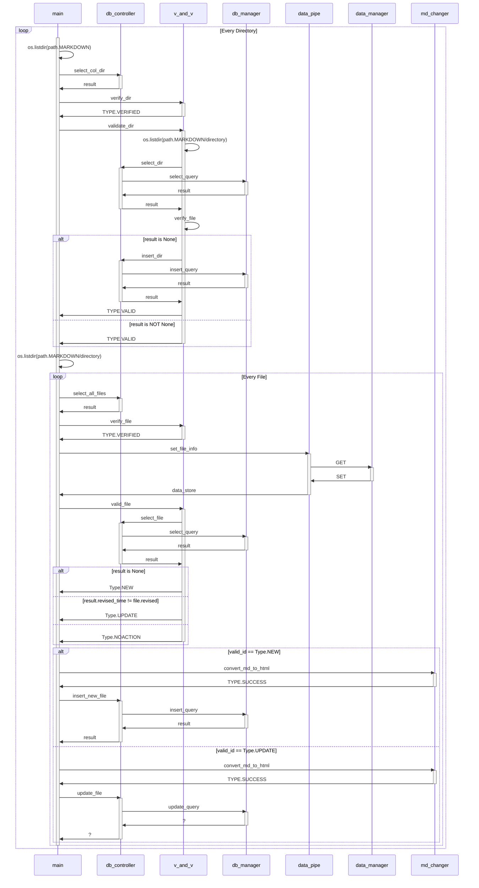

# Quasar: Markdown to html and database creator

Jul.2025 - 

## with 'pip install markdown'

### Memo
1. python3 -m venv .env
2. source .env/bin/activate
3. pip install markdown

## Sequence Diagram

