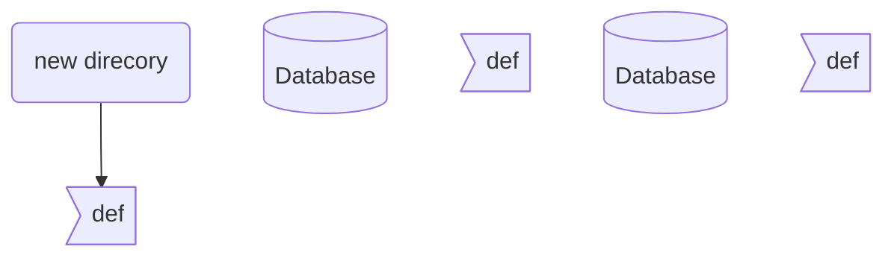

# Quasar: Markdown to html and database creator

## with 'pip install markdown'

### Memo
1. python3 -m venv .env
2. source .env/big/activate
3. pip install markdown

## 1. New directory

```mermaid
flowchart TB
	target(new direcory)
	def1>def]
	db1[(Database)]
	def2>def]
	db2[(Database)]
	def3>def]
	target --> def1
```